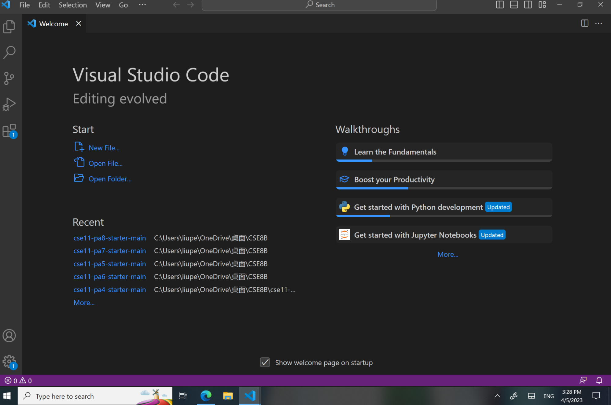

# Lab Report 1

To download Visual Studio Code, go to the website [Link](https://code.visualstudio.com/)  There are different version for Windows and Macs. This is what your screen should look like after opening VS Code upon downloadinh. (It's normal if the recent field it's empty on your screen. Since I used VS code before it automatically shows up the file I ahve opened.)

