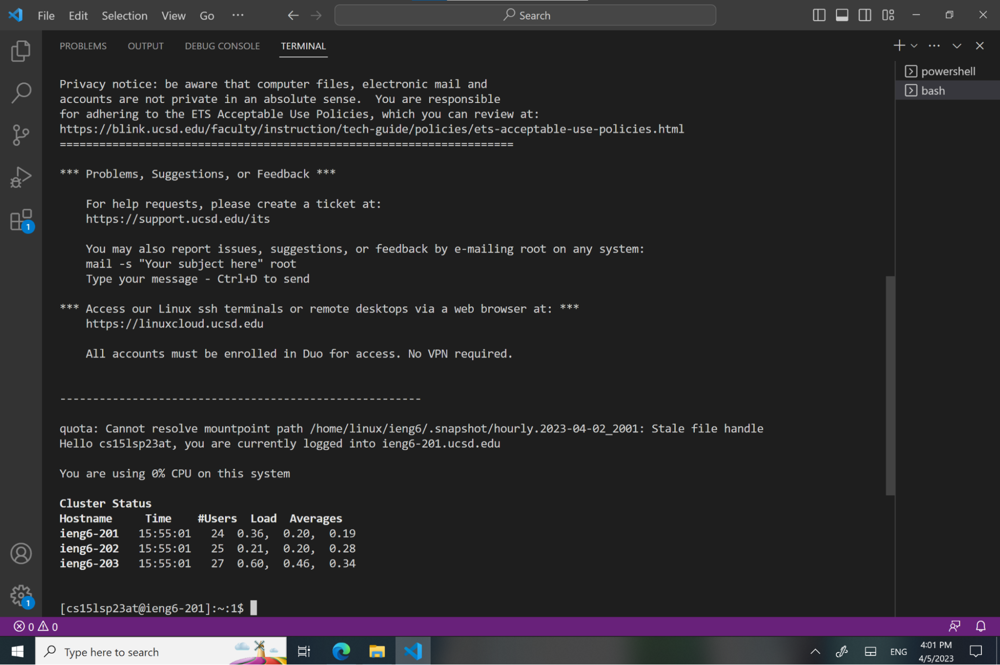
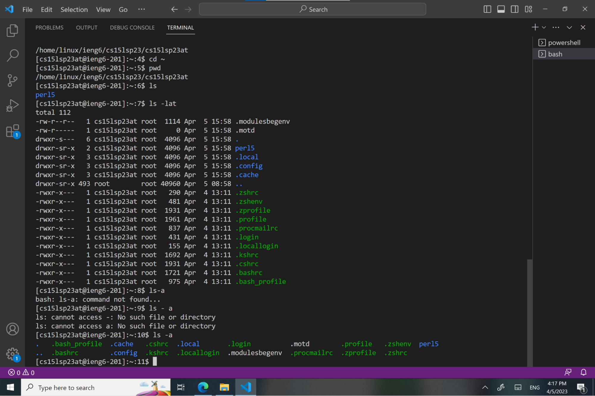

# Lab Report 1
## Installing VSCode

To download Visual Studio Code, go to the website [Download VS Code](https://code.visualstudio.com/). There are different versions for Windows and Macs. This is what your screen should look like after opening VS Code. (It's ok if the recent field is empty on your screen. Since I used VS code before it automatically shows up the file I opened recently.)

## Remotely Connecting
The next step is to install git at [Download git](https://gitforwindows.org/) 

Open a new terminal in VS Code. Go to this post to see how to change your default terminal[Using bash on windows](https://stackoverflow.com/questions/42606837/how-do-i-use-bash-on-windows-from-the-visual-studio-code-integrated-terminal/50527994#50527994)

Then, type in **$ ssh accountName@ieng6.ucsd.edu**, replace "accountName" with your acount that starts with "cse15l." Type in "yes" if the question "Are you sure you want to continue connecting" pops up. Finally, enter the password you created for your account to complete login.

Your terminal should look similar to the picture below after logged in.

## Trying Some Commands
Congratulations! Now you have successfully connected to a computer in CSE Department. From now on, whatever commands you type in will run on the computers at the basement of CSE building. It's the time to try out some commands to see what you will get. For Example:
* **cd ~**      "Change directory"  
Output: Navigate to the home directory (for me it's: /home/linux/ieng6/cs15lsp23/cs15lsp23au)
* **pwd**     "Print working directory" 
Output: /home/linux/ieng6/cs15lsp23/cs15lsp23au
* **ls**   "List files in the given path"  
Output: cs15l2  cse15lab2  perl5
* **ls -lat**    "List all files (include hidden files) by their modification time"  
Output: -rw-r--r--   1 cs15lsp23au ieng6_cs15lsp23  1005 Apr 22 15:05 .modulesbegenv ( more files following...)
* **ls -a**   "List all files (include hidden files)"  
Output: .  ..  .bash_history  .cache  .config  .local  .modulesbegenv  .pki  .ssh  cs15l2  cse15lab2  perl5
* **cat /home/linux/ieng6/cs15lsp23/public/hello.txt**   "Print the content of files from the path" 
Output: Hello!

You can also use the screenshot below as an example of trying commands. 

