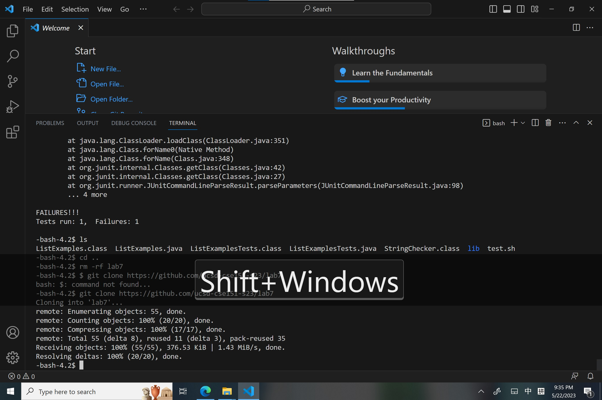
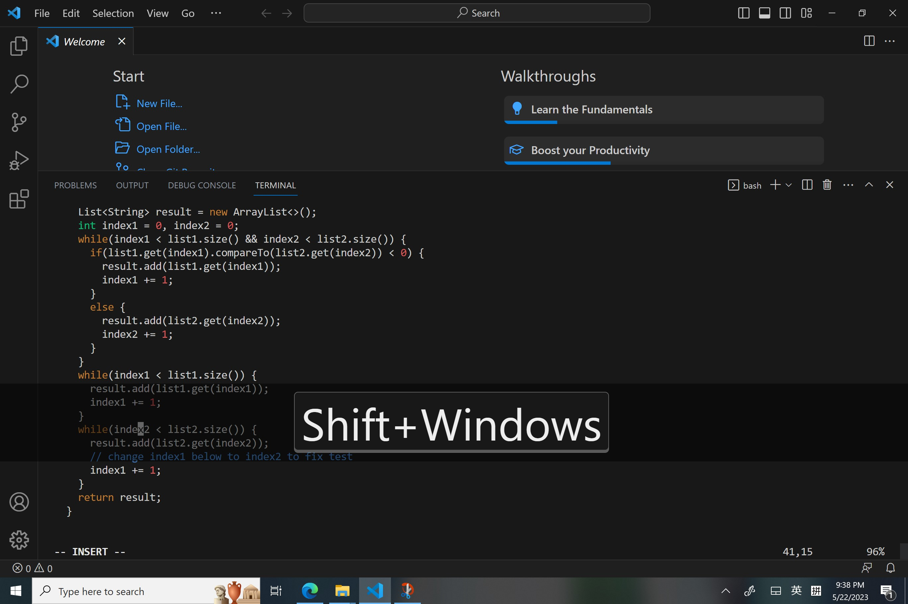

I typed in *<ssh cs15lsp23au@ieng6.ucsd.edu>* to log in to my account.

I copied the commant that clones the repository, which is *<git clone https://github.com/ucsd-cse15l-s23/lab7>*

I cloned the repository wth the above command.

I then copied the command *<javac -cp .:lib/hamcrest-core-1.3.jar:lib/junit-4.13.2.jar .java>*
and *<java -cp .:lib/hamcrest-core-1.3.jar:lib/junit-4.13.2.jar org.junit.runner.JUnitCore ListExamples.java>* 
to see that it actually fails.

I them typed in *<vim ListExamples.java>* to edit the file
  
  

  
I used the key *<jjhhj i backspace 2 esc :wq>* to changed and saved file. 

Then I typed in <up up up enter> to recompile the file and <up up up enter> to run the files again. 
  
In the end, I commited the changes to the github useing GitHub Desktop.
  

