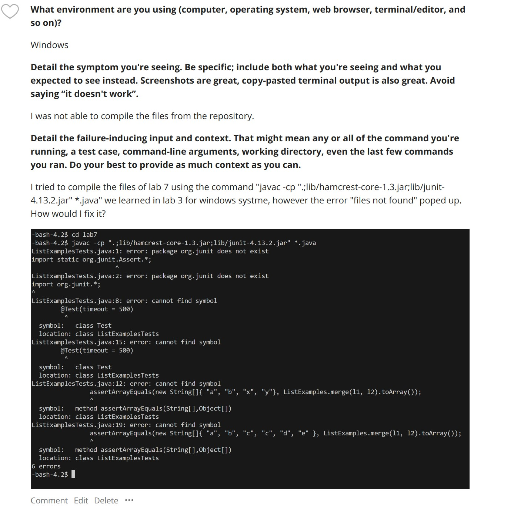
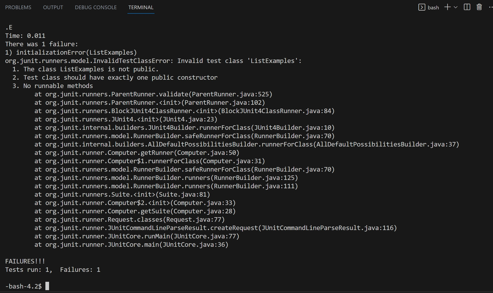

## Lab 5 Report ##


The Edstem question is listed below:


1. TA's response:

Check if you are connected to the ssh servers for our lab. If you are, used the command 
```"javac -cp .:lib/hamcrest-core-1.3.jar:lib/junit-4.13.2.jar *.java"```instead. 

Tips: This is the command for Mac users, since the school's computer is operating on Linux system the file would not compile with the windows command.  

2. Student's response with another attempt:

Thanks, now the files actually compile! The bug was that I used the compile commands for windows on my computer while it connected the ssh server, which actually runs on Linux. I have learnt that once we login into the school account we need to switch to the commands that runs on Linux system, since the computers here at UCSD is operating on Linux system (which is also the command for Macs)!

<br>

* The file is the same file we used for lab 7, in which we are asked to cloned the repository, change the working directory to lab 7 and then compile the file. However, in lab7's there were not any instruction about how to compile the files. Since I am working on windows, I assumed it would be the same command I used in lab3 to compile a bunch of files with class path. I ran into debugging this issue for several hours until I reached out to TA to switch commands. 

* The contents of all the file is listed below:

```// Takes two sorted list of strings (so "a" appears before "b" and so on),
  // and return a new list that has all the strings in both list in sorted order.
  static List<String> merge(List<String> list1, List<String> list2) {
    List<String> result = new ArrayList<>();
    int index1 = 0, index2 = 0;
    while(index1 < list1.size() && index2 < list2.size()) {
      if(list1.get(index1).compareTo(list2.get(index2)) < 0) {
        result.add(list1.get(index1));
        index1 += 1;
      }
      else {
        result.add(list2.get(index2));
        index2 += 1;
      }
    }
    while(index1 < list1.size()) {
      result.add(list1.get(index1));
      index1 += 1;
    }
    while(index2 < list2.size()) {
      result.add(list2.get(index2));
      // change index1 below to index2 to fix test
      index1 += 1;
    }
    return result;
  }```
